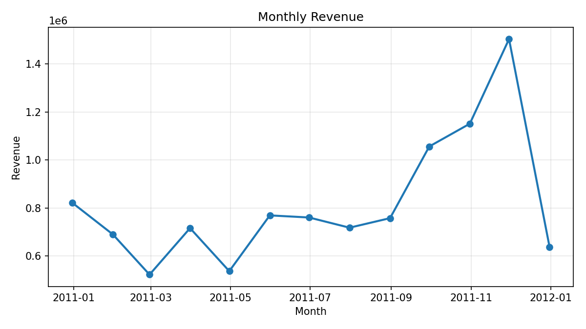
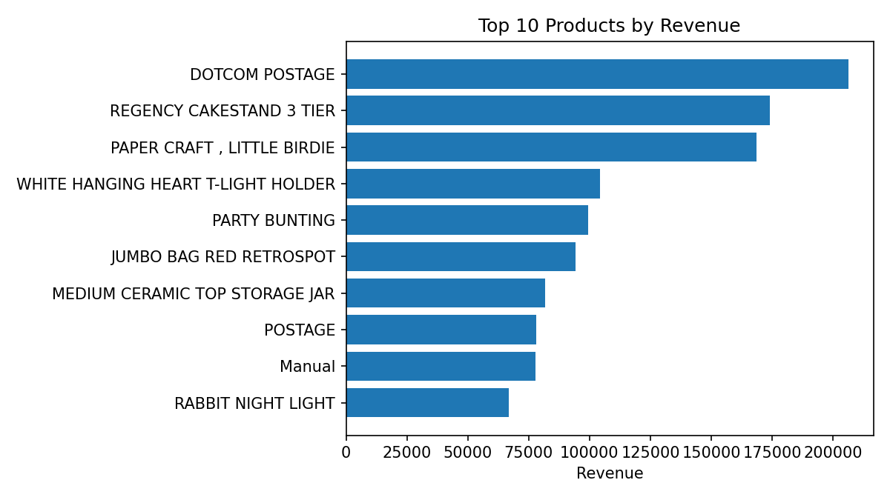
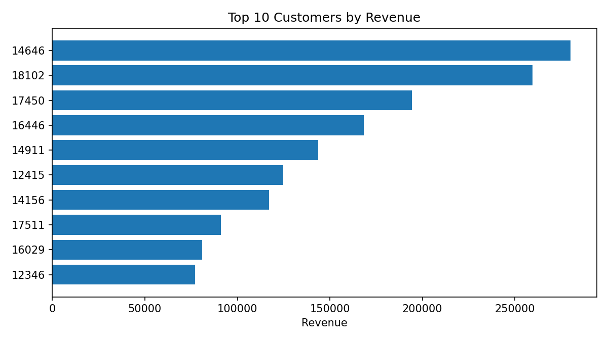

# KPI Summary Report - Online Retail Dataset

## Overview
Analysis window: **2010-12-01 to 2011-12-09**

## Core KPIs
| Metric | Value |
| --- | ---: |
| Total Revenue | 10,642,110.80 |
| Orders | 19,960 |
| Customers | 4,338 |
| Average Order Value | 533.17 |
| Items per Order | 279.18 |
| Unique Items per Order | 26.03 |

## Revenue by Month

## Top Countries by Revenue

## Top Products by Revenue

## Top Customers by Revenue

## Tables
### Top 10 Products by Revenue
| StockCode | Description | Revenue |
| --- | --- | --- |
| DOT | DOTCOM POSTAGE | 206248.77 |
| 22423 | REGENCY CAKESTAND 3 TIER | 174156.54 |
| 23843 | PAPER CRAFT , LITTLE BIRDIE | 168469.6 |
| 85123A | WHITE HANGING HEART T-LIGHT HOLDER | 104284.24 |
| 47566 | PARTY BUNTING | 99445.23 |
| 85099B | JUMBO BAG RED RETROSPOT | 94159.81 |
| 23166 | MEDIUM CERAMIC TOP STORAGE JAR | 81700.92000000001 |
| POST | POSTAGE | 78101.88 |
| M | Manual | 77750.27 |
| 23084 | RABBIT NIGHT LIGHT | 66870.03 |

### Top 10 Countries by Revenue
| Country | Revenue |
| --- | --- |
| United Kingdom | 9001744.094 |
| Netherlands | 285446.34 |
| EIRE | 283140.52 |
| Germany | 228678.4 |
| France | 209625.37 |
| Australia | 138453.81 |
| Spain | 61558.56 |
| Switzerland | 57067.6 |
| Belgium | 41196.34 |
| Sweden | 38367.83 |

### Top 10 Customers by Revenue
| CustomerID | Revenue |
| --- | --- |
| 14646 | 280206.02 |
| 18102 | 259657.3 |
| 17450 | 194390.79 |
| 16446 | 168472.5 |
| 14911 | 143711.17 |
| 12415 | 124914.53 |
| 14156 | 117210.08 |
| 17511 | 91062.38 |
| 16029 | 80850.84 |
| 12346 | 77183.6 |

## Evaluation
- Revenue is concentrated in a small number of countries and customers, indicating dependency risk.
- Monthly revenue shows seasonality and potential end-of-year spikes; this suggests inventory planning impact.
- High-performing SKUs can drive bundling strategies; long tail likely benefits from targeted promotions.