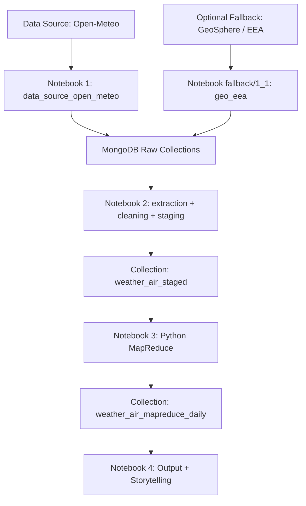

# Weather Air Vienna

Reproduzierbare Big-Data-Pipeline für Wetter- und Luftqualitätsdaten in Wien.

Ziel ist ein durchgängiger Workflow von Datenextraktion bis Ergebnisanalyse mit:
- Open-Meteo Ingestion (Wetter + Luftqualität)
- NoSQL Storage (MongoDB)
- Python-MapReduce auf Tagesebene
- Visualisierung und Storytelling in Jupyter

<a id="inhaltsverzeichnis"></a>
## Inhaltsverzeichnis

- [1. Projektziel](#projektziel)
- [2. Tech Stack](#tech-stack)
- [3. Projektstruktur](#projektstruktur)
- [4. Voraussetzungen](#voraussetzungen)
- [5. Inbetriebnahme (Schritt für Schritt)](#inbetriebnahme)
- [6. Data Flow (Extraction -> Result)](#data-flow)
- [7. Architektur](#architektur)
- [8. Big-Data-Kriterien (Kurzfassung)](#big-data-kriterien)
- [9. Einfache Kernaussagen (für Nicht-Techniker)](#kernaussagen)
- [10. Troubleshooting](#troubleshooting)

<a id="projektziel"></a>
## 1. Projektziel

Zentrale Frage:
Wie verhalten sich Wetterbedingungen (Temperatur, Luftfeuchtigkeit, Wind) im Zusammenhang mit PM2.5 in Wien?

Was dieses Repository liefert:
- eine lauffähige Infrastruktur (`docker compose`) mit MongoDB
- eine nachvollziehbare Notebook-Pipeline (0 -> 5)
- reproduzierbare Datenverarbeitung (Raw -> Staging -> Daily Aggregate)
- dokumentierte Architektur und Big-Data-Einordnung

<a id="tech-stack"></a>
## 2. Tech Stack

| Bereich | Technologie | Version / Hinweis |
|---|---|---|
| Sprache | Python | >= 3.9 |
| Notebook | JupyterLab | >= 4.2, < 5.0 |
| Datenanalyse | pandas, scipy, matplotlib, seaborn | siehe `requirements.txt` |
| Datenbank | MongoDB | 7.0.16 (Docker Image) |
| Aggregation | Python MapReduce (im Notebook) | `3_data_analysis_mapreduce.ipynb` |
| Orchestrierung | Docker Compose | via `docker compose` |

Wichtige Python-Dependencies stehen in `requirements.txt`.

<a id="projektstruktur"></a>
## 3. Projektstruktur

```text
weather-air-vienna/
|- data/
|  |- raw/
|  |  |- open_meteo/                      # exportierte Open-Meteo-Rohdaten (JSON)
|- docs/
|  |- architektur-setup-infrastruktur.md
|  |- BDInf-FinalProject-Specification.md
|  |- big-data-kriterien-5v-4levels.md
|- images/
|  |- Kernel_Setting_*.png                # Hilfsbilder für Kernel-Auswahl
|- notebooks/
|  |- 0_docker_compose_up.ipynb
|  |- 1_data_source_open_meteo.ipynb
|  |- 2_data_storage_extraction_cleaning_staging.ipynb
|  |- 3_data_analysis_mapreduce.ipynb
|  |- 4_data_output_storytelling.ipynb
|  |- 5_docker_compose_down.ipynb
|  |- fallback/
|     |- 1_1_data_source_geo_eea.ipynb    # optionaler/älterer Multi-Source-Pfad
|- docker-compose.yml
|- requirements.txt
|- .env.example
```

<a id="voraussetzungen"></a>
## 4. Voraussetzungen

- Python 3.9+
- Docker Desktop (oder Docker Engine + Compose Plugin)
- Git
- Jupyter Notebook/Lab oder VS Code mit Jupyter-Extension

Windows-Hinweis:
Lege das Projekt möglichst nahe am Laufwerks-Root ab (z. B. `C:\dev\wheater-air-vienna`), um Path-Length-Probleme zu vermeiden.

<a id="inbetriebnahme"></a>
## 5. Inbetriebnahme (Schritt für Schritt)

### 5.1 Repository vorbereiten

```cmd
cd C:\dev\wheater-air-vienna
copy ".env.example" ".env"
```

Optional: Passe Werte in `.env` an (`MONGO_ROOT_USERNAME`, `MONGO_ROOT_PASSWORD`, `MONGO_DB`, `MONGO_PORT`, `WIEN_LAT`, `WIEN_LON`, `TZ`).

### 5.2 Virtuelle Umgebung

Windows CMD:
```cmd
python -m venv weather_air_vienna_env
.\weather_air_vienna_env\Scripts\activate
```

Linux/macOS:
```bash
python -m venv weather_air_vienna_env
source weather_air_vienna_env/bin/activate
```

### 5.3 Abhängigkeiten installieren

```bash
pip install -r requirements.txt
```

### 5.4 Jupyter-Kernel registrieren

```bash
python -m ipykernel install --user --name=weather_air_vienna_env --display-name "weather-air-vienna (env)"
```

### 5.5 Notebooks in korrekter Reihenfolge ausführen

Pfad: `notebooks/`

1. `0_docker_compose_up.ipynb`
   Erwartung: Container `weatherair-mongodb` läuft.
2. `1_data_source_open_meteo.ipynb` (Kernpfad für End-to-End)
   Erwartung: JSON-Exports in `data/raw/open_meteo` und Raw-Collections `weather_open_meteo_raw` sowie `air_open_meteo_raw`.
3. `2_data_storage_extraction_cleaning_staging.ipynb`
   Erwartung: Collection `weather_air_staged` ist gefüllt (bereinigt, dedupliziert).
4. `3_data_analysis_mapreduce.ipynb`
   Erwartung: Tagesaggregation in der Collection `weather_air_mapreduce_daily`.
5. `4_data_output_storytelling.ipynb`
   Erwartung: Visualisierungen + interpretierte Ergebnisse.
6. `5_docker_compose_down.ipynb`
   Erwartung: Stack wird sauber beendet (`docker compose down`, ohne Volume-Löschung).

Optional:
- `notebooks/fallback/1_1_data_source_geo_eea.ipynb` als zusätzlicher/älterer Multi-Source-Pfad (GeoSphere + EEA).

<a id="data-flow"></a>
## 6. Data Flow (Extraction -> Result)

1. Extraction:
   API-Ingest über Open-Meteo (Wetter + Luftqualität), optional zusätzlicher Fallback über GeoSphere/EEA.
2. Raw Storage:
   Rohdaten als JSON-Dateien unter `data/raw/open_meteo` und als MongoDB-Collections (`*_raw`).
3. Transformation/Staging:
   Normalisierung auf stundenbasierte Struktur in `weather_air_staged`.
4. MapReduce:
   Python-MapReduce (Map/Shuffle/Reduce) in Notebook `3_data_analysis_mapreduce.ipynb` zur Tagesaggregation.
5. Final Storage:
   Persistenz in `weather_air_mapreduce_daily`.
6. Analysis/Result:
   Korrelationsanalyse, Grafiken und Storytelling auf Tagesebene.

<a id="architektur"></a>
## 7. Architektur



Detaildiagramm und Komponentenliste:
- `docs/architektur-setup-infrastruktur.md` 

<a id="big-data-kriterien"></a>
## 8. Big-Data-Kriterien (Kurzfassung)

### 8.1 5 Vs

- Volume: Lange Zeitreihen mit stündlichen Messwerten erzeugen eine wachsende Datenmenge.
- Velocity: Regelmäßige Datenerzeugung und wiederholbare Pipeline-Runs.
- Variety: Unterschiedliche Rohdatenstrukturen (Wetter/Luftqualität, optional Multi-Source-Fallback), vereinheitlicht im Staging.
- Veracity: Data Cleaning, Idempotenz und Duplikatschutz in den Notebooks.
- Value: Verdichtete Tageskennzahlen für interpretierbare Umweltanalyse.

### 8.2 4 Levels of Data Handling

- Data Source: Open-Meteo als Hauptquelle, optional GeoSphere/EEA im Fallback-Notebook.
- Data Storage: NoSQL Layering (Raw -> Staged -> Daily).
- Data Analysis: Pandas + Python-MapReduce.
- Data Output: Visualisierungen und begründete Kernaussagen.

Detailargumentation:
- `docs/big-data-kriterien-5v-4levels.md`

<a id="kernaussagen"></a>
## 9. Einfache Kernaussagen (für Nicht-Techniker)

- Hohe Feinstaubwerte treten häufiger bei kalten, windarmen Bedingungen auf.
- Tagesaggregation (statt Stundenrauschen) macht Muster stabiler sichtbar.
- Wind zeigt in den Analysen eine klar negative Beziehung zu PM2.5.
- Die Pipeline ist reproduzierbar und damit für Teamarbeit und Vergleichsläufe geeignet.

<a id="troubleshooting"></a>
## 10. Troubleshooting

- Docker startet nicht:
  `docker compose version` prüfen, dann `docker compose up -d` im Projektroot ausführen.
- MongoDB-Verbindung fehlschlägt:
  Werte in `.env` prüfen und Containerstatus kontrollieren (`docker compose ps`).
- Notebook findet keinen Kernel:
  Kernel erneut registrieren (Abschnitt 5.4) und im Notebook explizit auswählen.
- Kein Ergebnis in `weather_air_mapreduce_daily`:
  Reihenfolge `1_data_source_open_meteo` -> `2_data_storage_extraction_cleaning_staging` -> `3_data_analysis_mapreduce` prüfen.
- Open-Meteo-Requests schlagen fehl:
  Internetverbindung prüfen und Notebook 1 erneut ausführen.
