# Architektur des Setups / Infrastruktur

Dieses Dokument beschreibt die aktuelle technische Architektur des Projekts `weather-air-vienna` (Stand: 2026-04-21).

## 1) Komponenten

- Datenquellen (extern, primär): Open-Meteo Weather API und Open-Meteo Air-Quality API.
- Datenquellen (optional/fallback): GeoSphere und EEA über `notebooks/fallback/1_1_data_source_geo_eea.ipynb`.
- Orchestrierung: Jupyter-Notebook-Pipeline `0` bis `5`.
- Storage: MongoDB-Container `weatherair-mongodb` (Image `mongo:7.0.16`).
- Verarbeitung: Python/Pandas + Python-MapReduce in `notebooks/3_data_analysis_mapreduce.ipynb`.
- Dateisystem: Rohdatenexport nach `data/raw/open_meteo/*.json`.
- Runtime: Python `>=3.9`, Docker Compose, lokale Projektstruktur.

## 2) Architekturdiagramm (Mermaid)

```mermaid
flowchart LR

    %% =========================
    %% Externe Datenquellen
    %% =========================
    subgraph EXT["Externe Datenquellen"]
        OMW["Open-Meteo<br/>Weather API"]
        OMA["Open-Meteo<br/>Air API"]
    end

    %% =========================
    %% Notebook-Ablauf (Hauptlogik)
    %% =========================
    subgraph NB["Jupyter Notebooks"]
        N0["0_docker_compose_up"]
        N1["1_data_source_open_meteo"]
        N2["2_data_storage_extraction<br/>cleaning_staging"]
        N3["3_data_analysis_mapreduce"]
        N4["4_data_output_storytelling"]
        N5["5_docker_compose_down"]
    end

    %% Hauptablauf der Notebooks
    N0 --> N1
    N1 --> N2
    N2 --> N3
    N3 --> N4
    N4 --> N5

    %% =========================
    %% Host-Dateisystem
    %% =========================
    subgraph FS["Host-Dateisystem"]
        RAW["data/raw/open_meteo/*.json"]
    end

    %% =========================
    %% MongoDB
    %% =========================
    subgraph MDB["MongoDB"]
        MONGO["Container<br/>weatherair-mongodb"]

        R3[("weather_open_meteo_raw")]
        R4[("air_open_meteo_raw")]
        ST[("weather_air_staged")]
        MR[("weather_air_mapreduce_daily")]
    end

    %% =========================
    %% Beziehungen der Datenquellen
    %% =========================
    OMW --> N1
    OMA --> N1

    %% =========================
    %% Artefakte je Notebook-Schritt
    %% =========================
    N1 --> RAW
    N1 --> R3
    N1 --> R4

    R3 --> N2
    R4 --> N2
    N2 --> ST

    ST --> N3
    N3 --> MR
    MR --> N4

    %% =========================
    %% Container-Lebenszyklus
    %% =========================
    N0 -. startet .-> MONGO
    N5 -. stoppt .-> MONGO

    %% =========================
    %% Styles
    %% =========================
    classDef source fill:#eef4ff,stroke:#4a6fa5,stroke-width:1.5px,color:#111;
    classDef notebook fill:#f3e8ff,stroke:#7e57c2,stroke-width:1.5px,color:#111;
    classDef storage fill:#eaf7ea,stroke:#2e7d32,stroke-width:1.5px,color:#111;
    classDef file fill:#fff7e6,stroke:#b7791f,stroke-width:1.5px,color:#111;
    classDef infra fill:#fdecec,stroke:#c0392b,stroke-width:1.5px,color:#111;

    class OMW,OMA source;
    class N0,N1,N2,N3,N4,N5 notebook;
    class RAW file;
    class MONGO infra;
    class R3,R4,ST,MR storage;
```

## 3) Datenfluss in Kurzform

1. `0_docker_compose_up.ipynb` startet den Docker-Stack und prüft `docker compose`.
2. `1_data_source_open_meteo.ipynb` lädt Wetter- und Luftqualitätsdaten für Wien, exportiert JSON nach `data/raw/open_meteo` und schreibt Rohdaten in MongoDB.
3. `2_data_storage_extraction_cleaning_staging.ipynb` liest Rohdaten, bereinigt/normalisiert sie und schreibt sie nach `weather_air_staged`.
4. `3_data_analysis_mapreduce.ipynb` führt eine Python-MapReduce-Aggregation auf Tagesebene aus und schreibt nach `weather_air_mapreduce_daily`.
5. `4_data_output_storytelling.ipynb` analysiert und visualisiert die Tagesdaten.
6. `5_docker_compose_down.ipynb` beendet den Stack ohne Volume-Löschung.

## 4) Infrastruktur-Eigenschaften

- Reproduzierbar: Containerisiert über `docker-compose.yml` und `.env`.
- Teamfähig: Standardisierte Notebook-Reihenfolge und nachvollziehbarer Schichtenaufbau in MongoDB.
- Idempotent angelegt: Staging- und Daily-Layer werden vor dem Re-Import im Zeitraum bereinigt, danach neu geschrieben.
- Erweiterbar: Optionaler Fallback-Ingest (GeoSphere/EEA) ist vorhanden.

